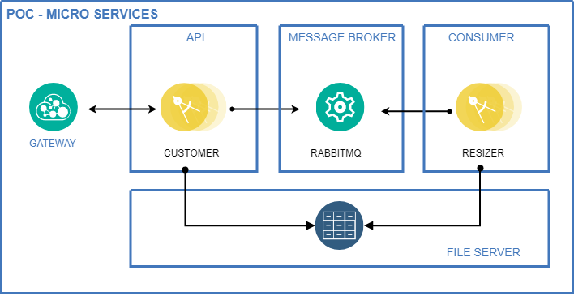

# POC Micro-Serviços

Este projeto é um compilado de testes de diversas tecnologias. Segue lista abaixo:

* [Ocelot API Gateway](https://github.com/ThreeMammals/Ocelot)
* [Consul Service Mesh](https://www.consul.io/)
* [RabbitMQ](https://www.rabbitmq.com/)
* [MassTransit Framework](https://github.com/MassTransit)
* [OpenZipkin - Distributed Tracing](https://zipkin.apache.org/)
* [Docker](https://docs.docker.com/)
* [Docker-Compose](https://docs.docker.com/compose/)
* [Kubernetes](https://kubernetes.io/pt/)

## Diagrama de comunicação

